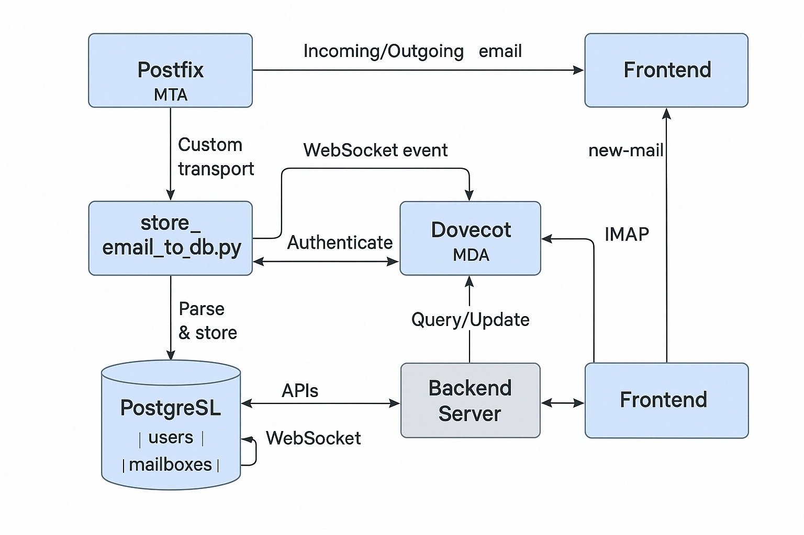

# Mailserver System Overview for Abysfin

# Mailserver System Overview for Abysfin

## 🏠 Platform: Abysfin Secure Mail

## 🏠 Platform: Abysfin Secure Mail

---

## ✨ Features Implemented

- **Send & Receive Emails** (with support for HTML & plain text)
- **Inbox, Sent, Trash/Bin Folders** with per-user mail visibility
- **Threaded Email View** (Gmail-style conversation view)
- **CC/BCC Support**
- **Reply Functionality** with In-Reply-To header
- **Mark Email as Read/Unread**
- **Soft Delete (Move to Trash) & Hard Delete**
- **Real-Time Email Notification** via WebSockets
- **Secure Auth** via JWT
- **Database-Backed Mail Storage** using PostgreSQL
- **User Registration & Login**

---

## 🔄 Email Workflow (Send/Receive)

### Sending an Email:
1. User logs in and composes an email (with optional CC, BCC).
2. Email is submitted to backend API.
3. Backend verifies sender via JWT.
4. Email is sent using Postfix (via Nodemailer) directly to recipient domain/server.
5. Email content is stored in PostgreSQL (`mailboxes` table) as a `Sent` folder entry.

### Receiving an Email:
1. Postfix receives incoming mail.
2. Postfix uses a custom transport (`dbmail`) to pipe email to `store_email_to_db.py`.
3. Python script parses raw email, stores it in PostgreSQL (`mailboxes` table).
4. Script emits a WebSocket event (using socket.io) to notify frontend.
5. Frontend updates the inbox in real-time.

---

## 📄 Tech Stack

| Layer              | Technology Used               |
|--------------------|-------------------------------|
| **Mail Server**    | Postfix                       |
| **Mailbox Access** | Dovecot (IMAP, SMTP Auth)     |
| **Spam Filter**    | (Coming soon) Rspamd          |
| **Mail Parsing**   | Custom Python script          |
| **Web Backend**    | Node.js (Express, PostgreSQL) |
| **Web Frontend**   | ReactJS (Gmail-style UI)      |
| **Real-Time**      | Socket.IO                     |
| **Database**       | PostgreSQL                    |
| **Authentication** | JWT-based auth                |

---

## 🔄 Real-Time Email Notification

- Socket.IO used between frontend and backend.
- `store_email_to_db.py` emits `new-mail` event on email arrival.
- Socket authenticates using JWT.
- Frontend listens and refreshes inbox if the event is for current user.

---

## 📁 Database Schema (Simplified)

### `users`
- id
- email
- password (hashed or plain for now)
- ...profile fields

### `mailboxes`
- id
- user_id (foreign key)
- subject
- body (HTML)
- plain_text
- from_email
- to_email
- cc, bcc
- folder (Inbox, Sent, Bin)
- is_read
- message_id
- in_reply_to
- thread_id
- created_at

---

## 📊 System Architecture Overview

- **Postfix**: Handles sending and receiving of emails.
- **Dovecot**: Handles IMAP and SMTP auth; stores mailbox metadata.
- **PostgreSQL**: Stores all parsed emails in structured format.
- **Node.js Backend**: API endpoints for frontend (auth, send, fetch, mark read, delete, etc.).
- **Python Parser**: Hooked to Postfix to parse and store incoming email.
- **Socket.IO**: Sends WebSocket events to notify clients in real-time.
- **React Frontend**: Gmail-like UI for user interaction.

---

## 📍 Visual Architecture Summary

The system is visually represented below: